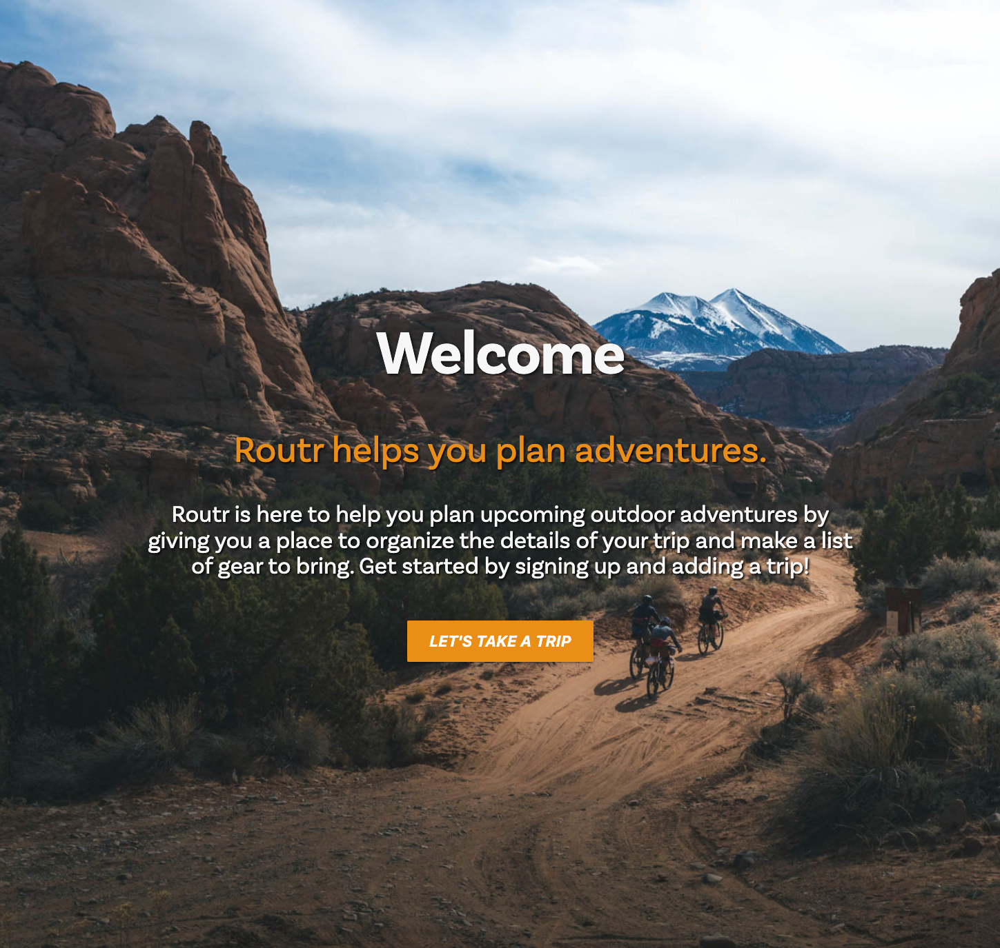
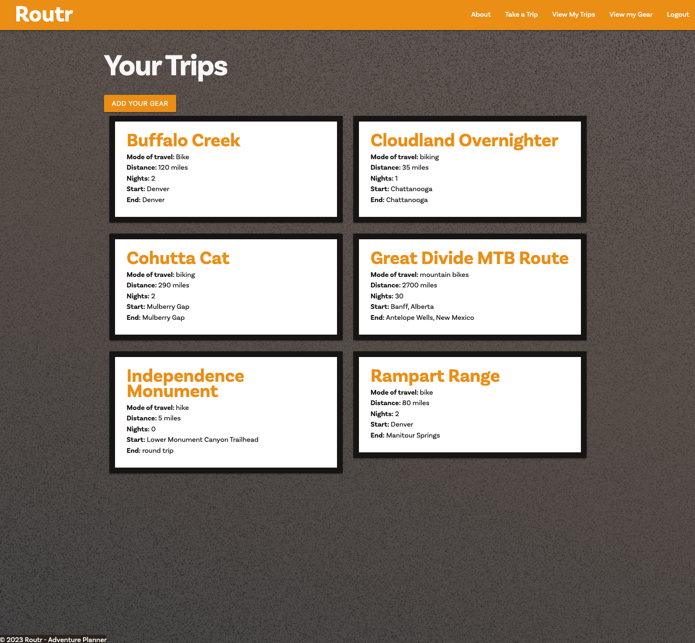
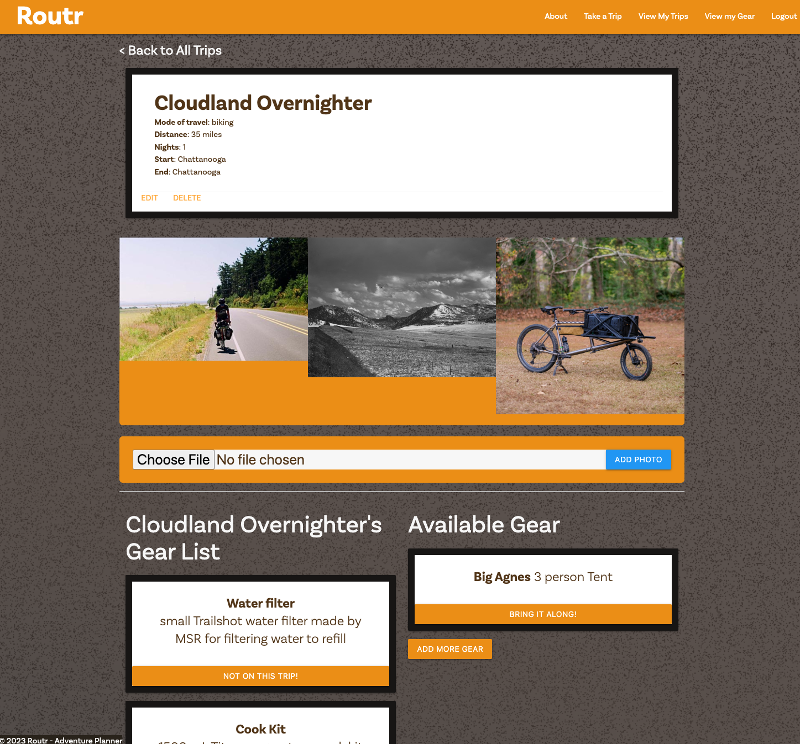

# Routr - Adventure Planner

<table>
<tr>
<td>
  Routr is here to help you plan upcoming outdoor adventures by giving you a place to organize the details of your trip and make a list of gear to bring. Get started by signing up and adding a trip!
  
  Getting Started - <a href='https://routr.herokuapp.com/'>Deploy Here.</a> After you've registered, you can create a trip, add your gear, or just know you now have a place to get organized for the next trip - big or small.
</td>
</tr>
</table>

## Development

Technologies Used:

- Django
- Python
- Heroku
- Figma
- Adobe Illustrator
- Github
- JS
- HTML
- CSS
- Visual Studio Code

## Site

### Landing Page

---

## To-do / Future Updates

- Allow routing via Google Maps API
- Display images in a gallery display
- Ability to save and associate Maps API routes to Trips and Gear
